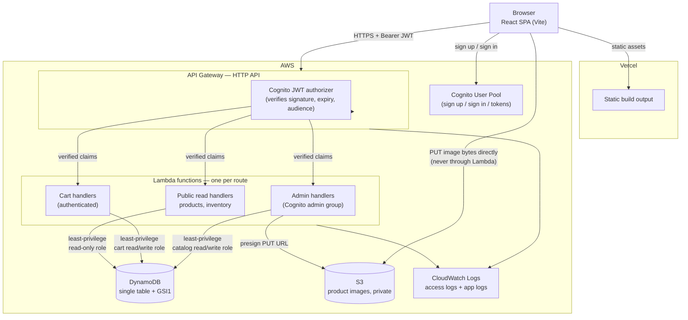

# CartFlow

A cloud-native e-commerce catalog, cart, and inventory system: a serverless AWS backend
(API Gateway, Lambda, DynamoDB, S3, Cognito) and a React storefront + admin dashboard,
built as a portfolio project to demonstrate production-oriented backend and cloud
engineering practices — not just CRUD endpoints, but concurrency control, least-privilege
IAM, idempotency, and a documented audit trail of design decisions.

[](https://github.com/arsal-nez/CartFlow/actions/workflows/backend-ci.yml)
[](https://github.com/arsal-nez/CartFlow/actions/workflows/frontend-ci.yml)

---

## 1. Project overview

CartFlow is a two-part monorepo:

- **`backend/`** — a TypeScript AWS Lambda API (Serverless Framework) fronted by API
  Gateway, storing data in a single DynamoDB table and product images in S3, with
  authentication and authorization via Cognito.
- **`frontend/`** — a React + TypeScript single-page app: a customer storefront (browse,
  cart, checkout is out of scope — see "Tradeoffs") and an admin dashboard (product CRUD,
  inventory management, image upload).

Both halves are independently deployable and independently tested, with their own CI
workflow, and are documented in enough depth (`docs/`, `PRODUCTION_READINESS.md`) to show
the reasoning behind each decision, not just the result.

## 2. Problem statement

Most portfolio e-commerce projects stop at "products in a database, a cart in state." This
one is scoped narrower but deeper: it picks a handful of problems that are genuinely hard to
get right in a serverless/NoSQL setting, and solves them completely rather than gesturing at
them —

- How do you design DynamoDB access patterns so every query is a targeted `Query`/`GetItem`,
  never a `Scan`, as the catalog grows?
- How do you stop two concurrent requests from corrupting a shared cart, or overselling
  stock, without a relational database's transactions?
- How do you let a browser upload an image straight to S3 without ever handing it AWS
  credentials or routing multi-megabyte payloads through a Lambda?
- How do you scope IAM permissions per function instead of one shared "can do everything"
  execution role?
- How do you make a "add to cart" retry (a flaky connection, a double-tapped button) safe
  instead of silently duplicating the action?

Each of those is answered in code, tested, and written up in `docs/database.md` and
`PRODUCTION_READINESS.md`.

## 3. Live demo

**Not currently deployed to a public URL.** The CI/CD pipeline (`.github/workflows/`) is
built and verified — `serverless package` succeeds for both stages and the frontend builds
cleanly — but an actual `serverless deploy` / Vercel deploy requires AWS and Vercel accounts
and credentials that are out of scope for this repository to provision automatically. See
[Local setup](#12-local-setup) to run the full stack yourself, or
[Deployment](#16-deployment) for exactly what `deploy.yml` would do against real accounts.

## 4. Architecture diagram



The key property this diagram is meant to show: **the browser talks to S3 and Cognito
directly** for the two things that don't need a Lambda in the middle (image bytes, token
issuance) — the API only ever handles small JSON payloads and authorization decisions.

## 5. Technology stack

**Backend**

|                 |                                                                                                                                        |
| --------------- | -------------------------------------------------------------------------------------------------------------------------------------- |
| Language        | TypeScript 5.5 (strict — `exactOptionalPropertyTypes`, `noUncheckedIndexedAccess`)                                                     |
| Runtime         | Node.js 18.x on AWS Lambda (`arm64`)                                                                                                   |
| Framework       | Serverless Framework v3 + `serverless-esbuild`                                                                                         |
| HTTP middleware | Middy v5 (`http-cors`, `http-json-body-parser`, custom auth/validation/error/idempotency middleware)                                   |
| Validation      | Zod                                                                                                                                    |
| AWS SDK         | AWS SDK for JavaScript v3 (`@aws-sdk/client-dynamodb`, `@aws-sdk/lib-dynamodb`, `@aws-sdk/client-s3`, `@aws-sdk/s3-request-presigner`) |
| Testing         | Jest (unit + full-stack integration tests against a fake DynamoDB client)                                                              |

**Frontend**

|              |                                                                                   |
| ------------ | --------------------------------------------------------------------------------- |
| Language     | TypeScript 5.5 (strict, same flags as backend)                                    |
| Framework    | React 18 + Vite 5                                                                 |
| Routing      | React Router 6                                                                    |
| Server state | TanStack Query 5                                                                  |
| Forms        | React Hook Form 7 + Zod (`@hookform/resolvers`)                                   |
| Auth         | Hand-written Cognito client (`fetch` against Cognito's public API) + `jwt-decode` |
| Testing      | Jest + Testing Library (`@testing-library/react`, `user-event`)                   |

**Tooling shared across both:** ESLint 9 (flat config, `typescript-eslint`), Prettier,
npm workspaces (single root `package-lock.json`), GitHub Actions.

## 6. AWS services

| Service                    | Role in this project                                                                                                                                                             |
| -------------------------- | -------------------------------------------------------------------------------------------------------------------------------------------------------------------------------- |
| **Lambda**                 | Runs every API handler; one function per route, each with its own IAM role (see [Design decisions](#18-design-decisions)).                                                       |
| **API Gateway (HTTP API)** | Routes requests, terminates TLS, runs the Cognito JWT authorizer before a Lambda executes, applies stage-wide throttling, writes structured access logs.                         |
| **DynamoDB**               | Single table, on-demand billing, one GSI (`GSI1`), point-in-time recovery configurable per stage, TTL enabled for idempotency records.                                           |
| **S3**                     | Private bucket for product images; all public access blocked; SSE-AES256; lifecycle rules for incomplete multipart uploads.                                                      |
| **Cognito**                | User pool with an `admin` and a `customer` group; issues the JWTs the API Gateway authorizer verifies.                                                                           |
| **CloudWatch Logs**        | API Gateway access logs and Lambda application logs, with an explicit per-stage retention period (no indefinite storage).                                                        |
| **IAM**                    | Three purpose-built execution roles (public-read / customer-cart / admin-write) instead of one shared role — see [Authentication architecture](#10-authentication-architecture). |
| **CloudFormation**         | Provisions all of the above; managed entirely through Serverless Framework, nothing clicked together by hand.                                                                    |

## 7. Feature list

**Storefront (customer-facing)**

- Product list with search (client-side, over the currently loaded page — see
  [Tradeoffs](#19-tradeoffs)), category filter, and cursor-based pagination.
- Product detail page: description, price, live stock status, add-to-cart.
- Cart: add / update quantity / remove line / clear, server-computed subtotal, an
  honestly-disabled "Proceed to checkout" button (no checkout flow exists — not faked).
- Email/password registration and sign-in against Cognito, with email confirmation.
- Route guards for authenticated-only and admin-only pages.

**Admin dashboard**

- Product CRUD (create / edit / archive), with Draft/Active/Archived status.
- Category selection via a combo box populated from real, currently-active categories (no
  hard-coded list — CartFlow has no separate "Category" entity).
- Inventory view with inline stock-quantity and reorder-threshold editing, and
  low-stock/out-of-stock badges.
- Image upload: presigned-URL flow straight to S3, with client-side content-type and the
  server-enforced size limit.
- Every admin route additionally gated by Cognito group membership, checked server-side.

**API / platform**

- Cursor-based pagination on every list endpoint.
- Optimistic-concurrency-safe cart and inventory writes (see
  [Design decisions](#18-design-decisions)).
- Idempotency-key support on the two POST endpoints that create a resource
  (`cart/items`, `products`).
- Structured JSON error envelope with a `requestId` on every response, an error `code`,
  and per-field validation `details` where relevant.

## 8. API endpoints

All business routes are versioned under `/api/v1`. "Auth" column: **Public** = no token
required, **Auth** = any signed-in Cognito user, **Admin** = signed-in and a member of the
Cognito `admin` group (checked server-side, not just hidden in the UI).

| Method | Path                              | Auth   | Description                                                         |
| ------ | --------------------------------- | ------ | ------------------------------------------------------------------- |
| GET    | `/health`                         | Public | Liveness check.                                                     |
| GET    | `/api/v1/products`                | Public | List active products (cursor pagination, optional category filter). |
| GET    | `/api/v1/products/{id}`           | Public | Get a single product.                                               |
| GET    | `/api/v1/products/{id}/inventory` | Public | Public stock view (available quantity + status only).               |
| POST   | `/api/v1/products`                | Admin  | Create a product. Idempotency-key aware.                            |
| PUT    | `/api/v1/products/{id}`           | Admin  | Partial update of a product.                                        |
| DELETE | `/api/v1/products/{id}`           | Admin  | Soft delete (archive) a product.                                    |
| GET    | `/api/v1/admin/products`          | Admin  | List products by status (draft/active/archived).                    |
| GET    | `/api/v1/admin/inventory/{id}`    | Admin  | Full inventory record (available, reserved, reorder threshold).     |
| PUT    | `/api/v1/admin/inventory/{id}`    | Admin  | Set available quantity and/or reorder threshold.                    |
| GET    | `/api/v1/cart`                    | Auth   | Get the caller's own cart, hydrated with current prices.            |
| POST   | `/api/v1/cart/items`              | Auth   | Add a product to the cart. Idempotency-key aware.                   |
| PATCH  | `/api/v1/cart/items/{productId}`  | Auth   | Set a line to an absolute quantity.                                 |
| DELETE | `/api/v1/cart/items/{productId}`  | Auth   | Remove a line.                                                      |
| DELETE | `/api/v1/cart`                    | Auth   | Empty the cart.                                                     |
| POST   | `/api/v1/uploads/presigned-url`   | Admin  | Get a short-lived S3 presigned PUT URL for a product image.         |

Full request/response contracts and error-code reference: `docs/api.md`.

## 9. DynamoDB schema

Single table, on-demand billing, partition key `PK` + sort key `SK`, one global secondary
index (`GSI1`) provisioned today. Everything below is what's actually implemented — see
`docs/database.md` for the full access-pattern-by-access-pattern reasoning.

| Entity             | PK                       | SK                      | GSI1PK                     | GSI1SK                                                            |
| ------------------ | ------------------------ | ----------------------- | -------------------------- | ----------------------------------------------------------------- |
| Product            | `PRODUCT#{productId}`    | `META`                  | `PRODUCTS#STATUS#{status}` | `CATEGORY#{categoryId}#NAME#{normalizedName}#PRODUCT#{productId}` |
| Inventory          | `PRODUCT#{productId}`    | `INVENTORY`             | —                          | —                                                                 |
| Cart header        | `USER#{userId}`          | `CART`                  | —                          | —                                                                 |
| Cart line          | `USER#{userId}`          | `CART#ITEM#{productId}` | —                          | —                                                                 |
| Idempotency record | `IDEMPOTENCY#{scopeKey}` | `RECORD`                | —                          | — (has a `ttl` attribute; auto-expires)                           |

Notable design points:

- Product and its inventory record share a partition (`PRODUCT#{productId}`), so a future
  checkout can read both in one `Query` and write both in one transaction.
- Cart header and all of a user's cart lines share partition `USER#{userId}` — the whole
  cart is one `Query`, and `SK` prefix `CART` matches both `CART` (header) and
  `CART#ITEM#...` (lines).
- `GSI1` powers both "list active products" (`GSI1PK` alone) and "list active products in
  category X" (`GSI1PK` + `begins_with(GSI1SK, ...)`) with no filter expression — status
  and category are baked into the key, not filtered after the fact.
- **No `Scan` exists anywhere in the codebase.** Every read is a targeted `GetItem` or
  `Query`.
- Inventory items already write `GSI3PK`/`GSI3SK` attributes in anticipation of a low-stock
  index, but `GSI3` itself isn't provisioned yet — see
  [Future improvements](#20-future-improvements).

## 10. Authentication architecture

- **Identity provider:** AWS Cognito User Pool, with an `admin` and a `customer` group.
  Password policy: 12+ characters, upper/lower/number required.
- **Token verification happens at API Gateway**, not in application code: every
  authenticated route has a Cognito JWT authorizer attached, which verifies signature,
  expiry, issuer, and audience _before a Lambda ever runs_. Application code only ever
  reads the already-verified claims off `event.requestContext.authorizer.jwt.claims` — it
  never parses or trusts a raw bearer token itself.
- **Authorization** (`admin` vs. plain authenticated) is a single check —
  `requireAdmin()` — reading the verified `cognito:groups` claim. No client-supplied role
  field is ever trusted anywhere in the codebase.
- **Defense in depth beyond that single check:** every Lambda function has its own
  least-privilege IAM execution role (`PublicReadExecutionRole` / `CustomerCartExecutionRole`
  / `AdminWriteExecutionRole`), so even a bug that bypassed the application-level admin
  check would still hit an IAM `AccessDenied` for anything outside that function's actual
  needs — a public read handler's role has no write permissions on the table at all.
- **Frontend sign-in** calls Cognito's public, unauthenticated JSON API directly via
  `fetch` (`USER_PASSWORD_AUTH`) rather than pulling in the full
  `@aws-sdk/client-cognito-identity-provider` package — a deliberate bundle-size tradeoff,
  documented and accepted because the app is HTTPS-only in every real deployment.
- **Session storage:** tokens live in `localStorage` (`frontend/src/auth/tokenStore.ts`).
  This is a known, explicit tradeoff, not an oversight — see
  [Tradeoffs](#19-tradeoffs).

## 11. S3 upload architecture

Product images never pass through a Lambda. The flow:

```text
1. Admin's browser -> POST /api/v1/uploads/presigned-url { contentType, contentLength }
                       (JWT authorizer + requireAdmin() gate this call)
2. Lambda           -> validates contentType against an allowlist (jpeg/png/webp) and
                        contentLength against MAX_UPLOAD_BYTES, generates a random
                        object key, asks S3 to presign a PUT for that exact key
3. Lambda           -> browser: { key, uploadUrl, method: "PUT", headers, expiresInSeconds }
4. Browser           -> PUT <uploadUrl>  (straight to S3, image bytes as the body — the
                        API and Lambda are no longer involved)
5. S3               -> stores the object privately, if signature/size/expiry all check out
6. Browser           -> attaches the returned `key` to a product via a normal
                        create/update product call
```

- **The object key is always server-generated** (`products/{randomUUID()}.{ext}`) —
  the request schema has no `fileName` field at all, so there's no input for a
  path-traversal or injection attempt to ride in on.
- **Size is enforced by IAM**, not just application code: the presigning role's policy
  carries an `s3:RequestObjectSize` condition, evaluated by S3 itself against the actual
  uploaded byte count — enforced even if a client lied about `contentLength` when
  requesting the URL.
- **A real, tested limitation, documented rather than glossed over:** a presigned PUT URL
  (unlike a presigned POST policy) cannot cryptographically bind the request to a specific
  `Content-Type` — verified with a unit test against `@aws-sdk/s3-request-presigner`'s
  actual behavior, not assumed. Mitigated by only ever presigning one of three allowlisted
  types in the first place; full closure would need a post-upload content verification
  step, which doesn't exist yet.
- The bucket blocks all public access; there is currently no public read path for a stored
  image (no CloudFront in front of it), so the UI shows an initials-based placeholder
  instead of an `` tag pointed at a URL that would 403.

Full write-up: `docs/database.md`, "Upload Consistency And Security".

## 12. Local setup

Requires Node.js ≥ 18.20 and npm ≥ 10. No AWS account is required to run lint/typecheck/test
or to `serverless package`; an AWS account (and `aws configure` credentials) is required
only to actually `serverless deploy`.

```bash
git clone https://github.com/arsal-nez/CartFlow.git
cd CartFlow
npm install                     # installs both workspaces from the one root lockfile

# Backend
cp backend/.env.example backend/.env       # for reference; serverless.yml supplies
                                            # real values from backend/config/*.yml at
                                            # package/deploy time
npm run build --workspace=backend          # `serverless package --stage dev` — validates
                                            # the whole stack, no AWS credentials needed

# Frontend
cp frontend/.env.example frontend/.env     # fill in real values once a backend is deployed
npm run dev --workspace=frontend           # Vite dev server on http://localhost:5173
```

To actually run the API locally against real AWS resources, deploy a `dev` stage
(`npm run deploy --workspace=backend` with `--stage dev`, once AWS credentials are
configured) and point `frontend/.env`'s `VITE_API_BASE_URL` at the printed API URL.

## 13. Environment variables

**Backend** (`backend/.env.example`) — in a real deployment these are supplied by
`serverless.yml`/`backend/config/{stage}.yml` and Terraform-free CloudFormation outputs,
not a committed `.env`; the example file exists for local reference and for tests:

| Variable                                         | Purpose                                                                                        |
| ------------------------------------------------ | ---------------------------------------------------------------------------------------------- |
| `NODE_ENV`                                       | `development` / `production`.                                                                  |
| `AWS_REGION`                                     | Region the Lambda runs in.                                                                     |
| `CARTFLOW_TABLE_NAME`                            | DynamoDB table name.                                                                           |
| `PRODUCT_IMAGES_BUCKET_NAME`                     | S3 bucket for uploads.                                                                         |
| `COGNITO_USER_POOL_ID` / `COGNITO_APP_CLIENT_ID` | Identify the user pool for JWT validation.                                                     |
| `JWT_ISSUER`                                     | Expected `iss` claim, derived from the user pool.                                              |
| `ALLOWED_ORIGINS`                                | CORS allowlist, comma-separated.                                                               |
| `UPLOAD_URL_EXPIRES_SECONDS`                     | Presigned URL lifetime.                                                                        |
| `MAX_UPLOAD_BYTES`                               | Authoritative upload size cap (also enforced via IAM — see [§11](#11-s3-upload-architecture)). |
| `DEFAULT_PAGE_LIMIT` / `MAX_PAGE_LIMIT`          | Pagination bounds.                                                                             |
| `ADMIN_GROUP_NAME`                               | Cognito group name treated as admin.                                                           |

**Frontend** (`frontend/.env.example`):

| Variable                                                                           | Purpose                                                                                                                                                 |
| ---------------------------------------------------------------------------------- | ------------------------------------------------------------------------------------------------------------------------------------------------------- |
| `VITE_API_BASE_URL`                                                                | Base URL of the deployed (or local) API.                                                                                                                |
| `VITE_COGNITO_USER_POOL_ID` / `VITE_COGNITO_APP_CLIENT_ID` / `VITE_COGNITO_REGION` | Identify the user pool the frontend signs against.                                                                                                      |
| `VITE_COGNITO_DOMAIN`                                                              | Cognito hosted-UI domain (present for completeness; the app's own login form talks to Cognito's API directly rather than redirecting to the hosted UI). |
| `VITE_COGNITO_REDIRECT_SIGN_IN` / `VITE_COGNITO_REDIRECT_SIGN_OUT`                 | OAuth redirect URLs.                                                                                                                                    |

**Deploy-time secrets** (GitHub Actions repository secrets, never committed — see
[CI/CD](#15-cicd)): `AWS_DEPLOY_ROLE_ARN`, `VERCEL_TOKEN`, `VERCEL_ORG_ID`,
`VERCEL_PROJECT_ID`.

## 14. Testing

|        | Backend | Frontend               |
| ------ | ------- | ---------------------- |
| Suites | 39      | 11                     |
| Tests  | 350     | 69                     |
| Runner | Jest    | Jest + Testing Library |

**Backend** — unit tests per repository/service/middleware/schema, plus full-stack
_integration_ tests that exercise a real API Gateway event through the actual Middy
middleware chain, real service logic, and either a fake `DynamoDBDocumentClient` (products)
or interface-level repository fakes (cart, whose DynamoDB-command shape is separately
verified by its own repository tests). Concurrency is tested for real: `cart.concurrency.test.ts`
races genuine `Promise.all` calls against an in-memory model that yields between read and
write, not just mocked call order. Every documented HTTP status this API returns (401, 403,
404, 409, 400, 500) has a corresponding test; the one it deliberately never returns (422) has
a test proving that too, verified against the actual body-parser library's source rather than
assumed.

**Frontend** — component tests for the product list, product detail, and cart pages (loading/
error/empty states, mocked API layer), route-guard tests for both auth and admin gates,
schema/validation tests, and the admin product form including image-upload edge cases
(disallowed type, oversized file).

Run everything: `npm test` from the repo root (or `--workspace=backend` /
`--workspace=frontend` to scope it). `npm run lint` and `npm run typecheck` run the same way.

## 15. CI/CD

Three GitHub Actions workflows (`.github/workflows/`):

| Workflow          | Trigger                                                                | Does                                                                     |
| ----------------- | ---------------------------------------------------------------------- | ------------------------------------------------------------------------ |
| `backend-ci.yml`  | PRs touching `backend/**`, pushes to `main`, reusable `workflow_call`  | install → lint → typecheck → test → build, scoped to `@cartflow/backend` |
| `frontend-ci.yml` | PRs touching `frontend/**`, pushes to `main`, reusable `workflow_call` | same, scoped to `@cartflow/frontend`                                     |
| `deploy.yml`      | Push to `main`, manual dispatch                                        | calls both CI workflows as jobs, then deploys — see below                |

**Deployment only happens after CI passes**, enforced structurally: `deploy.yml`'s deploy
jobs declare `needs: [backend-ci, frontend-ci]` against the _actual_ CI workflows (called as
reusable workflows, not reimplemented) — GitHub Actions cannot start a deploy job unless
both already succeeded in the same run.

Branch protection on `main` is what makes that gate meaningful rather than advisory — see
[Branch protection recommendations](#branch-protection-recommendations) below.

## 16. Deployment

- **Backend → AWS**, via the Serverless Framework (`serverless deploy --stage prod`),
  authenticated through GitHub's OIDC provider — `aws-actions/configure-aws-credentials`
  exchanges a short-lived token for temporary AWS credentials scoped to a specific IAM role.
  **No AWS access key or secret is stored anywhere** in GitHub or committed to source
  control.
- **Frontend → Vercel**, via the Vercel CLI (`vercel pull` → `vercel build` → `vercel deploy
--prebuilt`), authenticated with a Vercel API token stored as an encrypted GitHub secret.

Neither has actually been run against a live account for this repository — see
[Live demo](#3-live-demo).

## 17. Screenshots

Not included yet — the app has not been deployed to a stable URL to capture them from, and
placeholder/mocked screenshots would misrepresent what actually exists. To see the UI,
follow [Local setup](#12-local-setup) and run the frontend against a deployed `dev` backend.

## 18. Design decisions

- **DynamoDB single-table design, GSI1 only, no `Scan` anywhere.** Every access pattern
  was worked out before implementation (`docs/database.md`) and is either a `GetItem` on a
  known key or a `Query` on a partition/prefix.
- **Optimistic concurrency everywhere it's needed, not locking.** Cart writes use a
  `TransactWriteCommand` conditioned on the header's `updatedAt`; inventory writes condition
  on the counters themselves, not just a timestamp, so a write based on stale stock numbers
  fails rather than silently overselling. Both are exercised by real-interleaving
  concurrency tests, not just unit-mocked call order.
- **Presigned S3 uploads, never routing image bytes through a Lambda** — cheaper, avoids
  API Gateway payload limits, and keeps the Lambda's job to "is this caller allowed, is
  this a reasonable request" rather than buffering files in memory.
- **Per-function least-privilege IAM roles**, added after an explicit audit
  (`PRODUCTION_READINESS.md`) found every function sharing one role sized for the most
  privileged handler. A regression test parses `serverless.yml` itself so a new function
  added without an explicit role fails CI instead of silently inheriting broad access.
- **Idempotency-key support on the two genuinely non-idempotent POST endpoints**
  (`cart/items`, `products`), added after tracing through Middy's actual middleware-skip
  behavior (not assumed from its docs) to fix a real bug where a naive first version would
  have silently dropped CORS headers on a replayed response.
- **A hand-written Cognito `fetch` client on the frontend** instead of the full AWS SDK for
  Cognito Identity Provider, trading a small amount of hand-rolled request code for a
  meaningfully smaller bundle.
- **Honest UI over fabricated UI.** Product images render as initials placeholders (no
  public S3 read path exists yet — a real `` would just 403). The client-side
  product search is labeled as filtering only the currently-loaded page, because the
  backend has no full-text search. The "Proceed to checkout" button is visibly disabled
  with an explanatory tooltip rather than silently doing nothing.

## 19. Tradeoffs

- **No checkout/order flow.** The domain model, API, and cart all stop at "here's your
  cart and its subtotal" — there's no order creation, payment integration, or order
  history. This was a deliberate scope boundary, not an oversight; see
  [Future improvements](#20-future-improvements).
- **Client-side product search, not full-text.** It only filters products already loaded
  on the current page, clearly labeled as such in the UI, rather than pretending to search
  the whole catalog.
- **No low-stock bulk query.** The admin inventory page fetches each product's stock with
  an individual `GetItem` (N+1) rather than a single `Query` against a stock-status index.
  The `GSI3PK`/`GSI3SK` attributes are already written in anticipation of this, but the
  index itself isn't provisioned. Low severity at current scale, documented rather than
  fixed, in `PRODUCTION_READINESS.md`.
- **Coarse rate limiting, not per-user.** Stage-wide API Gateway throttling is a real
  request-flood safety net, but it's shared across every caller — one abusive client can
  still consume the whole stage's budget. True per-key throttling or a WAF rate-based rule
  would fix this at a recurring cost judged disproportionate to current traffic.
- **Idempotency covers sequential retries, not true concurrency.** Two requests carrying
  the identical idempotency key arriving at the exact same instant can both pass the
  cache-miss check before either has saved a record. Closing that fully needs a
  claim/lock step, which wasn't added — the goal was retry-safety for the common case
  (a client that timed out and tried again), not a distributed lock.
- **Tokens in `localStorage`, not an `httpOnly` cookie.** The pragmatic choice for a pure
  SPA calling an API Gateway JWT authorizer that expects an `Authorization: Bearer` header
  — cookies don't flow into that model without a proxy layer to move the token from a
  cookie into a header. No known XSS vector exists in the app today (React's default
  escaping, server-side HTML sanitization on every user-authored field), but this is a
  real, standing tradeoff, not an unconsidered one.
- **No AWS WAF, no Cognito Advanced Security Mode.** Both are real hardening options for a
  production launch at scale; both are recurring costs not justified at current,
  portfolio-scale traffic. The interim mitigation (stage throttling, strict input
  validation) is documented as exactly that — interim.

## 20. Future improvements

- Checkout and order flow: an `Order`/`OrderItem` entity design already exists in
  `docs/database.md` (`GSI2` for user order history) but isn't implemented.
- Provision `GSI3` and add a bulk low-stock/out-of-stock query, replacing the admin
  inventory page's current per-product fetches.
- A public image-serving path (e.g. CloudFront in front of the private S3 bucket) so
  product photos can actually render instead of falling back to initials.
- Post-upload content verification (a `HeadObject`/magic-byte check) to close the
  presigned-PUT content-type gap described in [§11](#11-s3-upload-architecture).
- AWS WAF with a rate-based rule, and/or Cognito Advanced Security Mode, once traffic or
  threat model justifies the added cost.
- Server-side full-text product search.
- An actual deployment, so [§3](#3-live-demo) and [§17](#17-screenshots) can stop being
  disclaimers.

## Repository layout

```text
cartflow/
  backend/     # Serverless Framework + AWS Lambda API
  frontend/    # React customer storefront + admin dashboard
  docs/        # Architecture, database, API, and environment reference
  .github/workflows/
  PRODUCTION_READINESS.md
```

## Branch protection recommendations

CI enforcement only matters if it can't be bypassed. Configure these on `main` under
**Settings → Branches → Branch protection rules**:

- **Require a pull request before merging** — disable direct pushes to `main` (including
  for admins, if your plan supports it).
- **Require status checks to pass before merging**, selecting the two CI jobs by name:
  - `Backend CI / Install, lint, typecheck, test, build`
  - `Frontend CI / Install, lint, typecheck, test, build`
- **Require branches to be up to date before merging.**
- **Require conversation resolution before merging.**
- **Do not allow bypassing the above settings**, including for repository administrators.

With this configured, `main` can only ever advance via a reviewed PR that passed both CI
workflows — the same precondition `deploy.yml` independently re-verifies before deploying
anything.

## Documentation

- `docs/database.md` — DynamoDB schema, every access pattern, concurrency model, upload
  security, and the IAM/idempotency write-ups referenced above.
- `docs/api.md`, `docs/architecture.md` — API and system design reference.
- `PRODUCTION_READINESS.md` — a full production-readiness audit (security, performance,
  cost, and more) with implemented fixes, tests, and explicitly justified deferrals.
